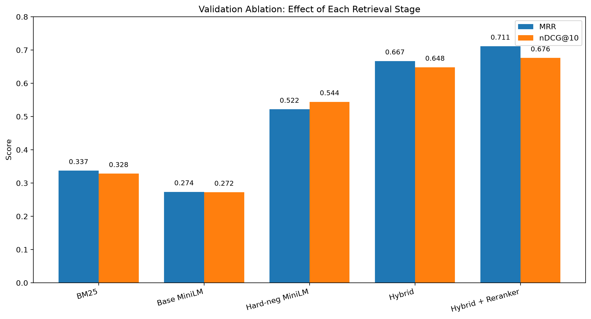
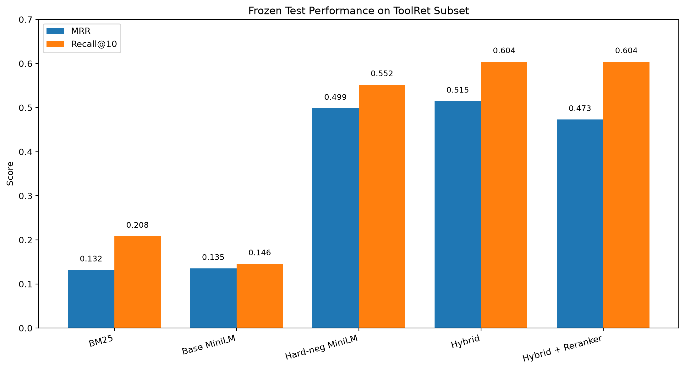

# Efficient Tool Retrieval for LLM Agents

Independent reproduction and extension of **ToolRet (ACL 2025)** exploring whether a lightweight multi-stage retrieval pipeline can improve tool retrieval for LLM agents.

The system combines **BM25 sparse retrieval, dense retrieval, hard-negative fine-tuning, weighted Reciprocal Rank Fusion (RRF), and compact cross-encoder reranking**. Experiments measure both retrieval quality and computational cost on a ToolRet subset containing **37,292 candidate tools**.

> **Status:** End-to-end experimental pipeline complete, including frozen held-out test evaluation.

---

## Research Question

Can a lightweight multi-stage retrieval pipeline combining sparse retrieval, dense retrieval, hard-negative training, and compact reranking substantially improve tool retrieval quality while keeping inference costs practical?

This repository investigates that question through controlled retrieval experiments rather than treating the original ToolRet implementation as a black box.

---

## Motivation

LLM agents increasingly rely on external tools and APIs. Before an agent can call the correct tool, however, it must first retrieve that tool from a potentially large catalog.

Tool retrieval is therefore an information-retrieval problem:

```text
Natural-language query
        |
        v
Large tool catalog
        |
        v
Retrieve relevant tools
        |
        v
LLM / agent tool selection
```

Poor retrieval can prevent an otherwise capable language model from ever seeing the correct tool.

This project studies whether relatively small retrieval models can be made substantially stronger through better training and multi-stage retrieval.

---

## System Architecture

The final experimental pipeline is:

```text
                         User Query
                             |
                 +-----------+-----------+
                 |                       |
                 v                       v
          BM25 Retrieval         Fine-tuned MiniLM
          Sparse Ranking          Dense Retrieval
                 |                       |
                 +-----------+-----------+
                             |
                             v
                    Weighted RRF Fusion
                  BM25 = 1.0
                  Dense = 1.25
                  RRF k = 10
                             |
                             v
                    Top-500 Candidates
                             |
                             v
                 Cross-Encoder Reranker
                     Rerank Top 3
                             |
                             v
                    Final Ranked Tools
                             |
                             v
                MRR / Recall@K / nDCG@K
```

The dense retriever is fine-tuned using mined hard negatives. Sparse and dense rankings are then combined with weighted Reciprocal Rank Fusion. A compact cross-encoder reranks only the highest-ranked candidates.

---

## Experimental Setup

The experiments use a processed subset of the ToolRet benchmark.

| Component | Configuration |
|---|---|
| Candidate tools | 37,292 |
| Validation queries | 15 |
| Frozen test queries | 16 |
| Base dense model | `sentence-transformers/all-MiniLM-L6-v2` |
| Fine-tuned retriever | MiniLM + hard-negative training |
| Sparse retriever | BM25 |
| Fusion | Weighted Reciprocal Rank Fusion |
| BM25 weight | 1.0 |
| Dense weight | 1.25 |
| RRF k | 10 |
| Candidate pool | 500 |
| Reranker | Compact cross-encoder |
| Final rerank depth | 3 |
| Evaluation | MRR, Recall@K, nDCG@K |

Hyperparameters were selected using the validation split before the final test evaluation.

The **16-query test split was treated as frozen** during final evaluation and was not used for subsequent hyperparameter tuning.

---

# Results

## Validation Ablation

The validation experiments show how retrieval quality changed as components were introduced.

| System | MRR | nDCG@10 |
|---|---:|---:|
| BM25 | 0.337 | 0.328 |
| Base MiniLM | 0.274 | 0.272 |
| Hard-negative MiniLM | 0.522 | 0.544 |
| Hybrid retrieval | 0.667 | 0.648 |
| Hybrid + reranker | **0.711** | **0.677** |



### Validation Findings

The largest dense-retrieval improvement came from **hard-negative fine-tuning**.

MRR increased from approximately:

```text
0.274 -> 0.522
```

after fine-tuning MiniLM on mined difficult negatives.

Combining sparse and dense retrieval produced another substantial improvement:

```text
0.522 -> 0.667 MRR
```

The compact cross-encoder then improved validation MRR further:

```text
0.667 -> 0.711
```

The validation experiments therefore support a multi-stage design in which sparse lexical matching and learned semantic retrieval contribute complementary signals.

---

## Frozen Test Results

After selecting the pipeline using validation experiments, the configuration was evaluated on the held-out test split.

| System | MRR | Recall@1 | Recall@3 | Recall@5 | Recall@10 | nDCG@10 |
|---|---:|---:|---:|---:|---:|---:|
| BM25 | 0.132 | 0.063 | 0.188 | 0.188 | 0.208 | 0.150 |
| Base MiniLM | 0.135 | 0.083 | 0.083 | 0.083 | 0.146 | 0.114 |
| Hard-negative MiniLM | 0.499 | 0.313 | 0.427 | 0.448 | 0.552 | 0.469 |
| Hybrid retrieval | **0.515** | **0.313** | **0.458** | **0.490** | **0.604** | **0.490** |
| Hybrid + reranker | 0.473 | 0.271 | 0.458 | 0.490 | 0.604 | 0.468 |



---

## Main Findings

### 1. Hard-negative training was the largest single improvement

The base MiniLM retriever achieved only **0.135 test MRR**.

After hard-negative fine-tuning, test MRR increased to approximately **0.499**.

This suggests that training on difficult, retrieval-specific negatives was considerably more important than simply using an off-the-shelf embedding model.

### 2. Sparse and dense retrieval were complementary

The weighted hybrid system increased test MRR from approximately:

```text
0.499 -> 0.515
```

and Recall@10 from:

```text
0.552 -> 0.604
```

relative to the fine-tuned dense retriever alone.

This supports the hypothesis that lexical BM25 evidence and dense semantic similarity capture different useful signals.

### 3. Reranking improved validation performance but did not generalize to test MRR

The cross-encoder increased validation MRR:

```text
0.667 -> 0.711
```

but decreased frozen-test MRR:

```text
0.515 -> 0.473
```

while Recall@10 remained approximately **0.604**.

This is an important negative result: adding a learned reranker did not automatically improve held-out retrieval performance.

One plausible explanation is sensitivity to the small training/validation sample, but the present experiment is not large enough to establish the cause.

### 4. Validation and test performance differed substantially

The final reranked system achieved approximately **0.711 validation MRR** but **0.473 test MRR**.

Because the current validation and test subsets contain only 15 and 16 queries respectively, these estimates have high variance.

The project therefore reports both validation and held-out results rather than presenting the best validation score as final performance.

---

## Latency

The frozen reranked pipeline recorded approximately:

| Stage | Mean query latency |
|---|---:|
| BM25 retrieval | 34.6 ms |
| Dense retrieval | 212.2 ms |
| RRF fusion | 0.18 ms |
| Cross-encoder reranking | 14.6 ms |

The dense retrieval stage dominates query-time cost in the current implementation.

The reranker operates only on the top three fused candidates, limiting its additional latency.

These measurements reflect the current experimental implementation and local hardware rather than an optimized production retrieval service.

---

## Why This Repository Is Independent

The official ToolRet implementation is treated as a benchmark reference.

This repository independently implements the core experimental components so that individual design decisions can be inspected and modified:

- ToolRet data processing
- BM25 retrieval
- dense embedding retrieval
- retrieval metrics
- reciprocal-rank fusion
- weighted RRF
- hard-negative mining
- dense retriever fine-tuning
- cross-encoder training
- reranking
- validation ablations
- latency measurement
- frozen test evaluation
- result visualization

The objective is not simply to reproduce a reported number, but to understand **which retrieval components help, when they help, and what they cost**.

---

## Evaluation Metrics

### Mean Reciprocal Rank (MRR)

MRR measures how highly the first relevant tool appears in the ranking.

Higher is better.

### Recall@K

Recall@K measures how much of the relevant tool set appears within the first `K` retrieved results.

The experiments report:

```text
Recall@1
Recall@3
Recall@5
Recall@10
```

### nDCG@K

Normalized Discounted Cumulative Gain rewards systems that place relevant tools nearer the top of the ranking while accounting for ranking position.

---

## Repository Structure

```text
toolret-research/
├── README.md
├── pyproject.toml
├── assets/
│   ├── test_results.png
│   └── validation_ablation.png
├── checkpoints/
├── data/
│   ├── sample/
│   └── toolret/
│       ├── corpus.jsonl
│       ├── queries.jsonl
│       └── splits/
├── models/
├── paper/
│   └── notes.md
├── results/
├── scripts/
│   ├── create_query_splits.py
│   ├── evaluate_dense_models.py
│   ├── evaluate_hybrid_finetuned.py
│   ├── evaluate_hybrid_reranker.py
│   ├── mine_hard_negatives.py
│   ├── plot_results.py
│   ├── prepare_toolret.py
│   ├── run_bm25.py
│   ├── run_candidate_ablation.py
│   ├── run_dense.py
│   ├── run_hybrid.py
│   ├── run_rrf_ablation.py
│   ├── train_dense_hard_negatives.py
│   └── train_toolret_reranker.py
├── src/toolret_research/
│   ├── bm25.py
│   ├── data.py
│   ├── dense.py
│   ├── fusion.py
│   ├── hard_negatives.py
│   ├── hybrid.py
│   ├── metrics.py
│   ├── reranker.py
│   └── text.py
└── tests/
    └── run_tests.py
```

---

## Reproducing the Core Experiments

Create and activate a Python environment, install the project dependencies, and run commands from the repository root.

For scripts executed directly from `scripts/`, expose the source package with:

```bash
PYTHONPATH=src
```

For example, the BM25 evaluation interface can be inspected with:

```bash
PYTHONPATH=src python scripts/run_bm25.py --help
```

The dense-model comparison can be inspected with:

```bash
PYTHONPATH=src python scripts/evaluate_dense_models.py --help
```

The hybrid retrieval experiment can be inspected with:

```bash
PYTHONPATH=src python scripts/evaluate_hybrid_finetuned.py --help
```

Figures are generated with:

```bash
PYTHONPATH=src python scripts/plot_results.py
```

---

## Research Integrity

Results in this repository are separated conceptually into:

1. **Paper-reported results** — values reported by the ToolRet authors.
2. **Reproduced results** — results generated by independent baseline experiments in this repository.
3. **Extension results** — results produced by the hard-negative, hybrid retrieval, and reranking experiments developed here.

No metric should be presented as a paper result unless it was actually reported by the original authors.

No metric should be presented as a project result unless it was generated by a reproducible experiment in this repository.

The frozen test set is not used for post-hoc hyperparameter selection.

---

## Limitations

The current experiments have several important limitations.

The validation and test subsets are small, containing **15 and 16 queries** respectively. Consequently, metric estimates can have substantial variance and should not be interpreted as definitive benchmark-wide performance.

The dense retrieval implementation is also optimized for experimental clarity rather than production-scale approximate nearest-neighbor search.

The reranker results demonstrate that stronger validation performance does not necessarily translate into stronger held-out performance.

Future work should evaluate larger query sets, multiple random seeds or folds, improved negative sampling, approximate nearest-neighbor indexing, and more robust reranker training.

---

## Next Steps

Planned extensions include:

- larger-scale evaluation
- retrieval failure analysis
- query-category breakdowns
- confidence intervals / repeated splits
- approximate nearest-neighbor indexing
- memory and index-size measurements
- reranker generalization analysis
- additional hard-negative strategies
- full technical report

---

## Acknowledgment

This project is inspired by **ToolRet: Retrieval Models Aren't Tool-Savvy: Benchmarking Tool Retrieval for Large Language Models (ACL 2025)**.

The original work provides the benchmark and motivation; the retrieval pipeline, experiments, extensions, analysis, and visualizations in this repository are developed as an independent research reproduction and extension.