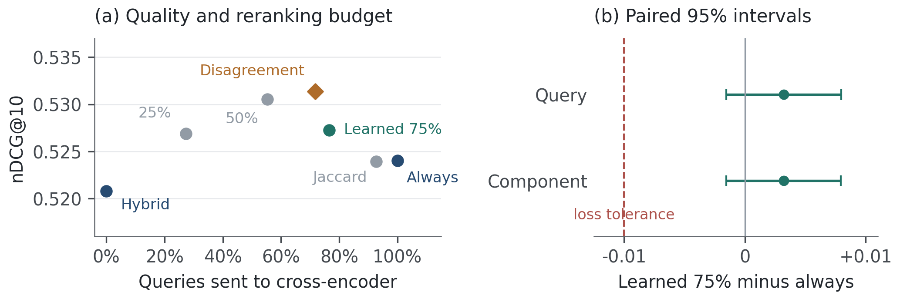
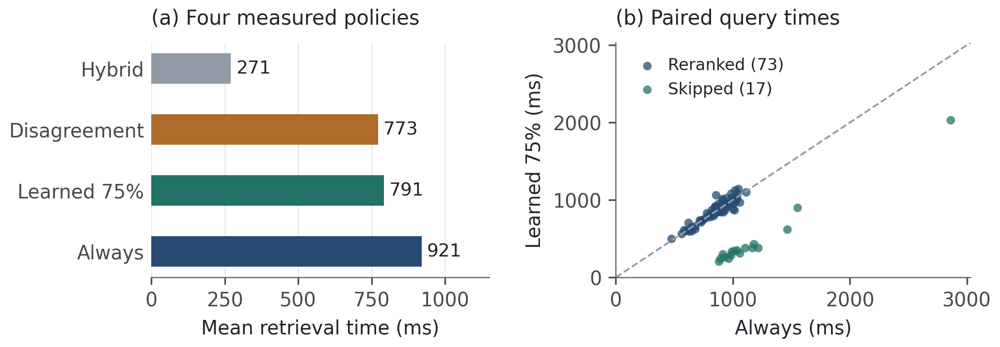

# ToolRet: When to Rerank Tool Retrieval

Completed independent undergraduate empirical research on routing cross-encoder work over **37,292 tools**. The study uses **300 development, 300 calibration, and 1,500 untouched confirmation queries** across APIGen, ToolACE, and ToolBench. Protocol and model checkpoints were public before confirmation inference. Completed October 3, 2026.

**Primary result:** the learned utility router used **1,149 instead of 1,500 real CE calls (23.4% fewer)**. Held-out binary nDCG@10 was **0.5273**, versus **0.5241** for always-on reranking. The predeclared 0.01 absolute nDCG loss tolerance **met** under both query and relevant-tool-component uncertainty estimates. This does not establish superiority.

**Measured timing:** on 90 source-balanced confirmation queries, three repetitions per policy, warm sequential CPU mean retrieval time was **791.4 ms versus 920.7 ms**, a **14.0% observed reduction**. This is measured query-to-ranking time, including routing; initialization, network, queueing and concurrent serving are excluded.

An important finding is that **the simple disagreement gate has a stronger observed quality/compute tradeoff than the learned primary router**. The report retains the learned router as the prospectively declared primary and shows the competing baseline openly. Added complexity is not demonstrated to be better here.

- [Eight-page completed technical report](paper/tool_disjoint_reranking_study_20261003.pdf) · [Markdown source](paper/tool_disjoint_reranking_study_20261003.md)
- [Completion manifest](results/research_confirmation_20261003/study_completion.json) · [Independent audit](results/research_confirmation_20261003/independent_audit.json)
- [Reproduction instructions](docs/confirmation_reproduction.md) · [Technical interview walkthrough](docs/interview_walkthrough.md)

## What this study contributes

This is an empirical extension of the [ToolRet benchmark](https://aclanthology.org/2025.findings-acl.1258/): a runnable conditional reranking implementation, supervised transfer evaluation with disjoint positive-tool components, budget-matched allocation controls, real conditional execution and repeated latency, and independently recomputed results. Learned per-query gating has prior work; no new gating algorithm or benchmark-wide state-of-the-art claim is made.

The original 300-query pilot is development data for this extension. All new neural retrieval/reranking uses pinned off-the-shelf public models; the seven-feature ridge router is fitted locally on development queries only.

## Pipeline and frozen design

1. BM25 and `sentence-transformers/all-MiniLM-L6-v2` each retrieve 100 tools. Dense retrieval encodes the query and searches the complete catalog exactly.
2. Equal-weight reciprocal rank fusion combines ranks with constant 60.
3. A ridge regression predicts the per-query nDCG benefit of reranking using seven inexpensive first-stage features: top-1 disagreement, top-10/top-20 overlap, weighted overlap, rank coherence, log whitespace-query length, and normalized RRF top-score margin.
4. A frozen pointwise threshold decides whether to call `cross-encoder/ms-marco-MiniLM-L-6-v2` over the first 20 fused tools. Skips return hybrid retrieval; the ranking tail is preserved.

No relevance labels, expensive model scores, source identifiers or endpoint semantics enter the routing features. Tool IDs only support overlap/position comparisons; consistently renaming them leaves features unchanged. Ridge regularization is fixed at 10. Standardization uses development data only; calibration prediction quantiles set nominal 25%, 50%, and 75% call budgets without calibration-label fitting. These targets are not exact test quotas.

| Setting | Frozen value |
|---|---|
| Development / calibration / confirmation | 300 / 300 / 1,500 queries |
| Confirmation source balance | 500 queries per source |
| Relevant-tool components in confirmation | 1,174 |
| Cohort separation | Zero shared query IDs, normalized texts, positive tool IDs or components |
| Observed-pilot-connected extras | 629 quarantined, excluded from fitting and confirmation |
| Query allocation | Deterministic whole-component hash order and fixed quotas |
| Primary / reference | Utility 75% target / always rerank |
| Primary criterion | Both paired 95% CI lower bounds > -0.01, plus fewer CE calls |
| Uncertainty | 10,000 paired source-stratified query and component bootstrap draws |
| Controls | Fixed/Jaccard gates; 20 global matched-budget seeds per routing target; 20 source-count-matched seeds for primary/fixed gates |
| Inference | CPU, four PyTorch threads, one interop thread, batch 64, sequence limit 256 |

Components connect queries through shared positive tool IDs. This is separation of supervised router exposure; all tools remain in the searchable catalog. It is not verified API-family separation or proof of clean public-model pretraining.

## Confirmation quality and required work

| Policy | nDCG@10 | MRR@10 | Recall@10 | Required CE calls / 1,500 |
|---|---:|---:|---:|---:|
| BM25 | 0.4689 | 0.4725 | 0.5840 | 0 |
| Base MiniLM | 0.4602 | 0.4583 | 0.5911 | 0 |
| Hybrid RRF | 0.5208 | 0.5196 | 0.6522 | 0 |
| Always rerank | 0.5241 | 0.5301 | 0.6499 | 1,500 |
| Disagreement gate | 0.5314 | 0.5388 | 0.6538 | 1,077 |
| Jaccard gate | 0.5239 | 0.5276 | 0.6513 | 1,391 |
| Utility 25% target | 0.5269 | 0.5272 | 0.6549 | 409 |
| Utility 50% target | 0.5305 | 0.5339 | 0.6569 | 829 |
| Utility 75% target (primary) | 0.5273 | 0.5327 | 0.6520 | 1,149 |

Positive benchmark relevance grades are converted to binary labels. Recall measures labeled positives retrieved, not downstream execution success. Every CE call scores 20 pairs. The primary's **22,980 real pairs and 351 actual skipped calls** were independently verified across every confirmation query; every decision and final ranking matched frozen evaluation.

| Primary utility-minus-always difference | Mean | Paired 95% interval |
|---|---:|---:|
| Source-stratified query bootstrap | +0.003201 | [-0.001560, +0.007984] |
| Source-stratified component bootstrap | +0.003201 | [-0.001558, +0.007931] |

The 0.01 margin is a declared engineering tolerance, not a universal quality standard. Both intervals include zero: superiority to always-on reranking is not established. Utility 75% versus the source-matched random-control mean also includes zero (component interval [-0.001379, +0.007557]). The report shows the fixed gate and all exploratory budget/control results; the learned primary is not replaced after inspecting the holdout.



| Source (500 queries each) | Hybrid nDCG | Always nDCG | Fixed gate nDCG | Primary utility nDCG | Primary calls |
|---|---:|---:|---:|---:|---:|
| APIGen | 0.5851 | 0.6145 | 0.6225 | 0.6169 | 472 |
| ToolACE | 0.6186 | 0.6372 | 0.6383 | 0.6348 | 303 |
| ToolBench | 0.3588 | 0.3204 | 0.3333 | 0.3301 | 374 |

The primary skips **60 beneficial reranks, avoids 87 harmful reranks, and leaves 204 neutral queries unchanged**. Net aggregate quality does not imply every query benefits. A label-aware matched-budget oracle is included only as an unattainable diagnostic ceiling.

## Actual repeated CPU timing

Every timed request performs BM25, dense query encoding, exact full-corpus search/sort, fusion, routing and conditional CE inference. Models, corpus embeddings and indexes stay loaded. A deterministic 30-query-per-source subset is measured three times for each of four policies in counterbalanced order: **1,080 actual requests**. No concurrent heavy study workload ran during measurement.

| Policy | Mean ms | p50 query-mean ms | p95 query-mean ms | Actual CE calls / requests |
|---|---:|---:|---:|---:|
| Hybrid RRF | 271.1 | 242.1 | 378.4 | 0 / 270 |
| Always rerank | 920.7 | 907.0 | 1172.3 | 270 / 270 |
| Disagreement gate | 772.5 | 847.7 | 1137.3 | 210 / 270 |
| Utility 75% target (primary) | 791.4 | 850.9 | 1083.7 | 219 / 270 |

Percentiles summarize each query's three-repetition mean; raw-event percentiles are reported separately. The primary mean-time reduction interval is **[8.2%, 20.0%]**, using a paired source-stratified query bootstrap. Call savings and measured latency savings are separate quantities. These results concern one warm sequential CPU setting.



## Failure analysis

The ToolBench reranking regression replicates on the untouched cohort: always-on CE lowers nDCG by 0.038396 relative to hybrid, with 116 wins, 184 losses and 200 ties. **132/500 queries have no positive label in the scored prefix**; 94 positive labels leave the top ten while 47 enter it. Candidate coverage limits what reranking can recover. Some requests have several labeled operations, and CE promotes one while demoting another.

Tokenization and unjudged cross-source counterpart diagnostics are descriptive. They do not establish truncation as a cause, semantic equivalence, missing relevance judgments, or verified task failure. Original labels remain unchanged. See [complete diagnostics and selected cases](results/research_confirmation_20261003/confirmation_failure_analysis.md).

## Reproduce

```bash
python3.12 -m venv .venv
.venv/bin/python -m pip install 'torch==2.14.1+cpu' --index-url https://download.pytorch.org/whl/cpu
.venv/bin/python -m pip install -r requirements-research-20261003.txt
.venv/bin/python scripts/run_confirmation_study.py --output-dir data/research_reproduction_run1
.venv/bin/python -m pytest -q
```

The one-command runner downloads absent pinned source files, verifies exact hashes, and evaluates the published cache/router into a new directory. `--recompute` regenerates calibration/confirmation inference and refits the router from the published development cache. `--measure-runtime` adds actual full-cohort conditional execution and repeated end-to-end retrieval timing; it regenerates corpus embeddings if absent. Full clone ancestry preserves the public protocol freeze; shallow-clone guidance is in [the reproduction guide](docs/confirmation_reproduction.md).

Default replay was exercised, producing byte-identical predictions, decisions, per-query metrics and report. Live downloads of all five pinned source parquets also reconstructed the corpus and every cohort with exact frozen hashes. See [the scoped reproduction receipt](results/research_confirmation_20261003/reproduction_validation.json). Cross-machine neural floating-point behavior and timings can differ; fresh metadata is not promised byte-identical. Run timing without another heavy workload.

## Inspect the evidence

- [Public protocol freeze](https://github.com/michaelbawuah/toolret-hybrid-retrieval/commit/3e813e1af650104f33aaf77febce5a8c1a3f1213) and [public fitted-router freeze](https://github.com/michaelbawuah/toolret-hybrid-retrieval/commit/9a34862b31881545a266145b2096c0673b449182)
- [Frozen protocol](configs/confirmation_protocol_20261003.json), [data audit](results/research_confirmation_20261003/data_audit.json), [component inventory](results/research_confirmation_20261003/component_assignments.json), [router artifact](results/research_confirmation_20261003/router/model.json)
- [Full ranking cache](results/research_confirmation_20261003/confirmation_cache/rankings.jsonl), [manifest](results/research_confirmation_20261003/confirmation_cache/manifest.json), [frozen routing predictions](results/research_confirmation_20261003/confirmation_eval/frozen_predictions.jsonl)
- [Quality/controls/intervals](results/research_confirmation_20261003/confirmation_eval/summary.json), [full real conditional verification](results/research_confirmation_20261003/runtime_verification.json), [raw repeated latency](results/research_confirmation_20261003/latency/events.jsonl)
- [Independent recomputation: 317 passing checks](results/research_confirmation_20261003/independent_audit.json), [final completion record](results/research_confirmation_20261003/study_completion.json)
- Runtime implementations: [learned utility router](src/toolret_research/utility_runtime.py), [fixed selective router](src/toolret_research/selective_runtime.py)

The evaluator summary is immutable and records runtime as pending at evaluation time. The companion completion record binds the later real runtime, timing and audit by their hashes; it does not rewrite historical evidence.

## Historical work and scope

The [300-query pilot report](paper/selective_reranking_pilot_20261003.pdf) and [prior published README](results/research_confirmation_20261003/historical_pilot_README.md) are preserved. The original project also tested separately trained models on 16 APIBank queries; those trained checkpoints are unavailable and those scores are not this study. The [historical metric audit](results/research_20261003/historical_audit.md) corrects inconsistent old README claims.

This completes the declared empirical study. Source/budget/control/failure comparisons are exploratory; the benchmark cohort is not representative production traffic. Publication acceptance, faculty supervision, API-family generalization, pretrained-data independence, and downstream agent execution are not claimed. Future work needs independently frozen cohorts for additional models, API-family maps, controlled ablations and execution evaluation.

## References and credit

Benchmark credit belongs to Shi et al., [Retrieval Models Aren't Tool-Savvy: Benchmarking Tool Retrieval for Large Language Models (Findings of ACL 2025)](https://aclanthology.org/2025.findings-acl.1258/). Related work includes Zheng et al., [ToolRerank (LREC-COLING 2024)](https://aclanthology.org/2024.lrec-main.1413/); Bacellar, [Per-Query Gating of LLM Rerankers for Multi-Hop Retrieval (2026 preprint)](https://arxiv.org/abs/2609.22880); and Wu, Guo and Li, [Lookahead-R (2026)](https://arxiv.org/abs/2609.35811). Their benchmark/method results are not directly comparable to this different frozen cohort and model stack.
