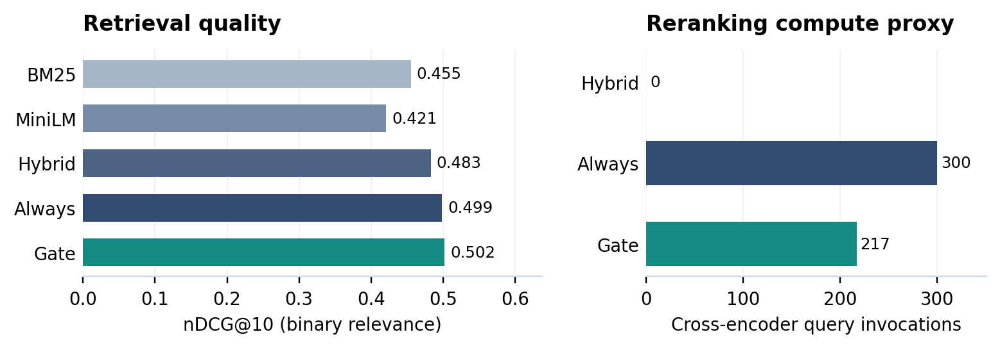

# ToolRet: Selective Tool Retrieval

Independent undergraduate research on **when to rerank tools for LLM agents**. This project builds on the [ToolRet benchmark](https://aclanthology.org/2025.findings-acl.1258/), with a new, fixed-protocol pilot completed on October 3, 2026.

**Measured result:** reranking only when BM25 and MiniLM disagree on their first result used **217 instead of 300 cross-encoder calls (27.7% fewer)**. Observed binary nDCG@10 was **0.5019**, compared with **0.4986** for always-on reranking. The paired 95% bootstrap interval for the difference is **[-0.0058, +0.0128]**; this pilot does not establish superiority or formal noninferiority.

The completed checkpoint includes real model inference, a callable selective reranker, saved per-query rankings, input/model fingerprints, matched-budget random controls, uncertainty estimates, and an independent recomputation audit. This is independent research, with no claimed faculty appointment or publication acceptance.

## Research question and implementation

Can disagreement between two cheap first-stage rankings identify queries worth spending cross-encoder compute on?

1. BM25 retrieves 100 tools; a frozen MiniLM encoder performs exact dense search over all 37,292 tools and retrieves 100.
2. Equal-weight reciprocal rank fusion combines these rankings, with RRF constant 60.
3. The **fixed gate reranks the first 20 fused tools if and only if BM25 top-1 differs from dense top-1**. Otherwise it returns the fused ranking without calling the cross-encoder. The remaining ranking stays unchanged.

The gate uses first-stage predictions only. Relevance labels are used for integrity checks and evaluation; they are never routing inputs. The protocol was committed before pilot rankings were generated and was not tuned to these results.

`src/toolret_research/selective_runtime.py` implements the runtime gate. A separate real-model verification replayed all 300 queries through it: **217 backend calls, 4,340 query/tool pairs, 83 skipped calls, and all rankings identical to the evaluated policy**. First-stage rankings were cached for this verification; it is not an end-to-end service latency benchmark.

## Pilot design

| Setting | Fixed value |
|---|---|
| Catalog | 37,292 ToolRet web tools |
| Queries | 300: 100 each from APIGen, ToolBench, ToolACE |
| Selection | SHA256 of fixed seed + query ID after normalized-text deduplication |
| Exclusions | All APIBank query texts; original 16 frozen-test IDs checked separately |
| Dense encoder | `sentence-transformers/all-MiniLM-L6-v2`, pinned revision |
| Reranker | `cross-encoder/ms-marco-MiniLM-L-6-v2`, pinned revision |
| Training | None for this pilot; off-the-shelf public models |
| Candidate / rerank depth | 100 per first-stage retriever / 20 fused tools |
| RRF / max sequence length | Equal weights, k=60 / 256 tokens |
| Hardware | CPU, 4 PyTorch threads, batch size 64 |
| Primary metric | Binary nDCG@10, macro-average over queries |
| Controls | BM25, dense, hybrid, always-rerank, fixed gate; 20 matched-budget random policies |
| Uncertainty | 20,000 paired query bootstrap resamples, 95% percentile intervals |

The initial proposed third source, MetaTool, contained customized-tool gold IDs absent from the web catalog. It was replaced by ToolACE after data validation and **before any pilot ranking generation**. The amendment is recorded in the fixed protocol. All selected positive gold IDs are present in the catalog.

This is a zero-training **source-domain pilot**. It does not establish generalization to unseen API families, independence from model pretraining data, or agent execution success.

## Results

| Policy | nDCG@10 | MRR@10 | Recall@10 | All positive labels covered@10 | CE calls | CE pairs |
|---|---:|---:|---:|---:|---:|---:|
| BM25 | 0.4553 | 0.4715 | 0.5614 | 0.4567 | 0 | 0 |
| Dense | 0.4210 | 0.4387 | 0.5330 | 0.4267 | 0 | 0 |
| Hybrid RRF | 0.4828 | 0.4785 | 0.6323 | 0.5267 | 0 | 0 |
| Always rerank | 0.4986 | 0.5113 | 0.6196 | 0.5100 | 300 | 6,000 |
| Selective gate | 0.5019 | 0.5180 | 0.6173 | 0.5100 | 217 | 4,340 |

All positive relevance grades are converted to binary relevance. Recall is the fraction of positive labels retrieved; all-positive coverage is the fraction of queries whose complete positive-label set is retrieved. These labels are not independently verified as the mandatory tool set for successful execution.

The 20 random policies rerank exactly 217 queries each (4,340 pairs). Their mean nDCG@10 is **0.4932**, with a seed range of **0.4816–0.5018**. This range describes random-control variation, not uncertainty on new queries.

| Primary nDCG@10 difference | Point estimate | Paired 95% interval |
|---|---:|---:|
| Always minus hybrid | +0.0158 | [-0.0090, +0.0410] |
| Gate minus hybrid | +0.0191 | [-0.0041, +0.0423] |
| Gate minus always | +0.0033 | [-0.0058, +0.0128] |

The practical finding is a **measured reduction in reranker invocations with a similar observed aggregate primary score**. It is not a blanket quality-preservation claim: selective Recall@10 is lower than hybrid Recall@10, and behavior differs by source.

| Source (100 queries each) | Hybrid nDCG@10 | Always nDCG@10 | Gate nDCG@10 | Gate calls |
|---|---:|---:|---:|---:|
| APIGen | 0.6120 | 0.6868 | 0.6818 | 69 |
| ToolACE | 0.5588 | 0.5551 | 0.5597 | 62 |
| ToolBench | 0.2775 | 0.2539 | 0.2642 | 86 |

**Failure finding:** reranking hurts ToolBench relative to hybrid retrieval. The fixed gate recovers part of that loss but still underperforms hybrid on that source. No configuration was changed after inspecting this result.

Component wall times were recorded once per query with warm models. Any policy sums are offline counterfactual estimates. **27.7% fewer calls/pairs is a compute-count result, not a measured 27.7% latency speedup.** Model loading, corpus encoding, routing overhead, network, concurrency, and deployment behavior are outside these measurements.

## Reproduce and inspect

The complete ranking cache is committed. Evaluation can be repeated without rerunning model inference after reconstructing the pinned input files.

```bash
python3.12 -m venv .venv
.venv/bin/python -m pip install 'torch==2.14.1+cpu' --index-url https://download.pytorch.org/whl/cpu
.venv/bin/python -m pip install -r requirements-research-20261003.txt
export PYTHONPATH=src
export HF_HUB_DISABLE_XET=1
D=data/research_20261003
R=results/research_20261003

.venv/bin/python scripts/prepare_research_pilot.py --output-dir "$D"

.venv/bin/python scripts/evaluate_selective_reranking.py \
  --cache "$R/pilot_cache/rankings.jsonl" \
  --corpus "$D/corpus.jsonl" --queries "$D/queries.jsonl" \
  --manifest "$R/pilot_cache/manifest.json" \
  --exclude-queries results/test_failure_analysis.csv \
  --output-dir results/research_reproduced --bootstrap-resamples 20000

.venv/bin/python -m pytest -q
```

The evaluator refuses mismatched corpus, query, and cache hashes; checks exact query/qrel/source alignment, declared cohort sizes, exact RRF reconstruction, and reranker-prefix/tail integrity. The source selection script refuses to overwrite a prepared directory.

To rerun model inference into new output/checkpoint directories:

```bash
.venv/bin/python scripts/generate_research_cache.py \
  --corpus "$D/corpus.jsonl" --queries "$D/queries.jsonl" \
  --data-manifest "$D/manifest.json" \
  --protocol configs/selective_pilot_20261003.json \
  --output-dir results/research_rerun/pilot_cache \
  --embedding-dir checkpoints/research_rerun

.venv/bin/python scripts/verify_selective_runtime.py \
  --cache "$R/pilot_cache/rankings.jsonl" \
  --manifest "$R/pilot_cache/manifest.json" \
  --corpus "$D/corpus.jsonl" --queries "$D/queries.jsonl" \
  --output results/research_runtime_reproduced.json
```

Data/model revisions and package versions appear in the manifest. CPU floating-point and timing behavior may differ across machines. Raw upstream data and downloaded models are reconstructed from pinned public sources instead of being redistributed here.

## Evidence and report



- [Four-page research report (PDF)](paper/selective_reranking_pilot_20261003.pdf) and [technical report source](paper/selective_reranking_pilot_20261003.md)
- [Fixed protocol](configs/selective_pilot_20261003.json)
- [Archived local protocol-freeze commit](results/research_20261003/protocol_freeze.bundle) (Git bundle; prerequisite original commit `7ff0807`)
- [Pilot results and paired intervals](results/research_20261003/pilot_eval/summary.json)
- [Per-query rankings](results/research_20261003/pilot_cache/rankings.jsonl), [decisions](results/research_20261003/pilot_eval/decisions.jsonl), and [metrics](results/research_20261003/pilot_eval/per_query.jsonl)
- [Pinned data/model/cache provenance](results/research_20261003/pilot_cache/manifest.json)
- [Independent recomputation audit](results/research_20261003/independent_audit.json)
- [Real selective-call verification](results/research_20261003/runtime_verification.json)
- [Historical result audit](results/research_20261003/historical_audit.md)

## Historical experiments and corrections

The original project included hard-negative training, weighted fusion, and top-3 reranking on a 16-query APIBank test subset. Its trained checkpoints are not available in this checkout. The new pilot uses separately pinned off-the-shelf models and different source queries; its scores must not be interpreted as a rerun of those models.

An audit of the committed original per-query CSV reconstructs uncut MRR as follows:

| Historical method | CSV-derived MRR |
|---|---:|
| BM25 | 0.146065 |
| Fine-tuned dense | 0.521205 |
| Hybrid | 0.514667 |
| Reranked hybrid | 0.473000 |

The former README's BM25 0.132 and dense 0.499 values do not match the committed rows. Those claims are corrected here. The audited rows also do not support the former claim that hybrid has higher test MRR than fine-tuned dense. Base-model scores, other historical metrics, training outcomes, and latency claims cannot be independently reconstructed from that CSV and are not current verified results. The [original README snapshot](results/research_20261003/historical_README.md) is preserved for traceability.

## Limits and next research

The next substantive experiment should use an explicitly mapped API-family holdout, a larger untouched query cohort, and a preregistered noninferiority margin for nDCG. API-family clustering should also inform uncertainty estimation. Additional work includes candidate-recall diagnostics, repeated end-to-end latency measurement, and approximate dense indexing with recall checks.

The current pilot is small relative to the complete benchmark. Positive labels may be incomplete; related queries may make query-level bootstrap intervals optimistic. Sign tests are exploratory and uncorrected for multiple comparisons. Public model pretraining exposure is unknown. No benchmark-wide, state-of-the-art, publication, or production-scale claim is made.

## Acknowledgment

Benchmark credit belongs to the authors of [Retrieval Models Aren't Tool-Savvy: Benchmarking Tool Retrieval for Large Language Models (Findings of ACL 2025)](https://aclanthology.org/2025.findings-acl.1258/). This repository's selective-routing implementation, pilot, analysis, and audit are an independent extension.
